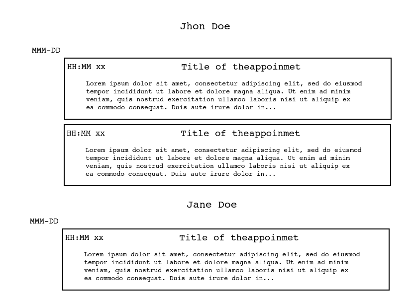

# v-appoinments

Single appoinment application frontend for practicing vue js, the project was created using vue cli

To start the idea is just create a view with very basic components showing an schedule with appoinments, like in the next draft image:



After cloning install dependencies

```bash
$ cd v-appoinments-project
$ npm install
```

To run the server 

```bash
$ cd v-appoinments-project
$ npm run serve
```
