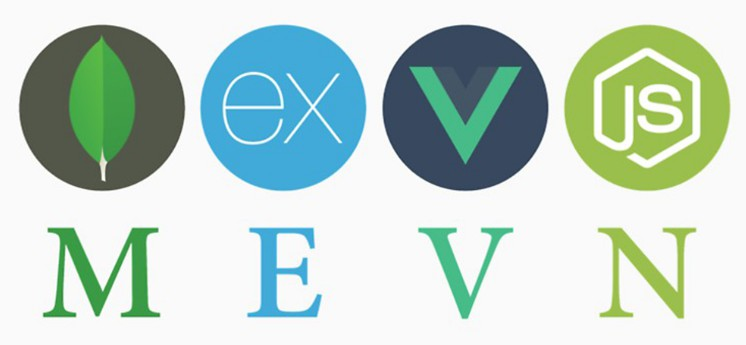

# v-appoinments

## About

Single appoinment application frontend for practicing vue js, the project was created using vue cli version 5.0.4

For a full experience this project is now related to the backend [n-appoinments](https://github.com/cardoso-dev/n-appoinments), *2022-July-25* to consume it as a backedn, this way the project becomes MEVN stack!



You should clone [n-appoinments](https://github.com/cardoso-dev/n-appoinments) as well and run all the project using docker compose included in the backend project *more info in n-appoinments' readme file*

## Design

Imagine you are a dentist, medical or therapist and you would like to have an app to easily check your appoinments.

The idea is you have the features to save, search and update your appoinments in a easy way

### Third party components
- [vue-time-date-range-picker](https://www.npmjs.com/package/vue-time-date-range-picker#demo)
- [VueCtkDateTimePicker](https://www.npmjs.com/package/vue-ctk-date-time-picker)

## Run standalone (without the n-appoinments backend)

To try it this way you can use an (old) version before consuming the backend, at the commit [d076a4fd](https://github.com/cardoso-dev/v-appoinments/commit/d076a4fdf70b2ed8e709fb812ab19a4a4d3a0c28)

After cloning install dependencies

```bash
$ cd v-appoinments-project
$ npm install
```

To run the server

```bash
$ cd v-appoinments-project
$ npm run serve
```